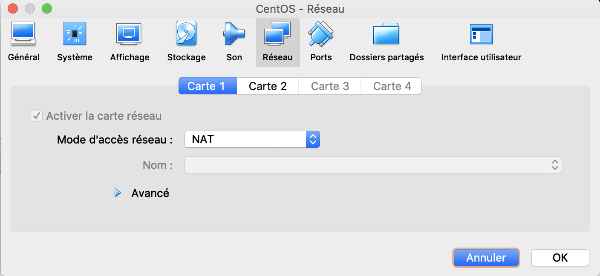
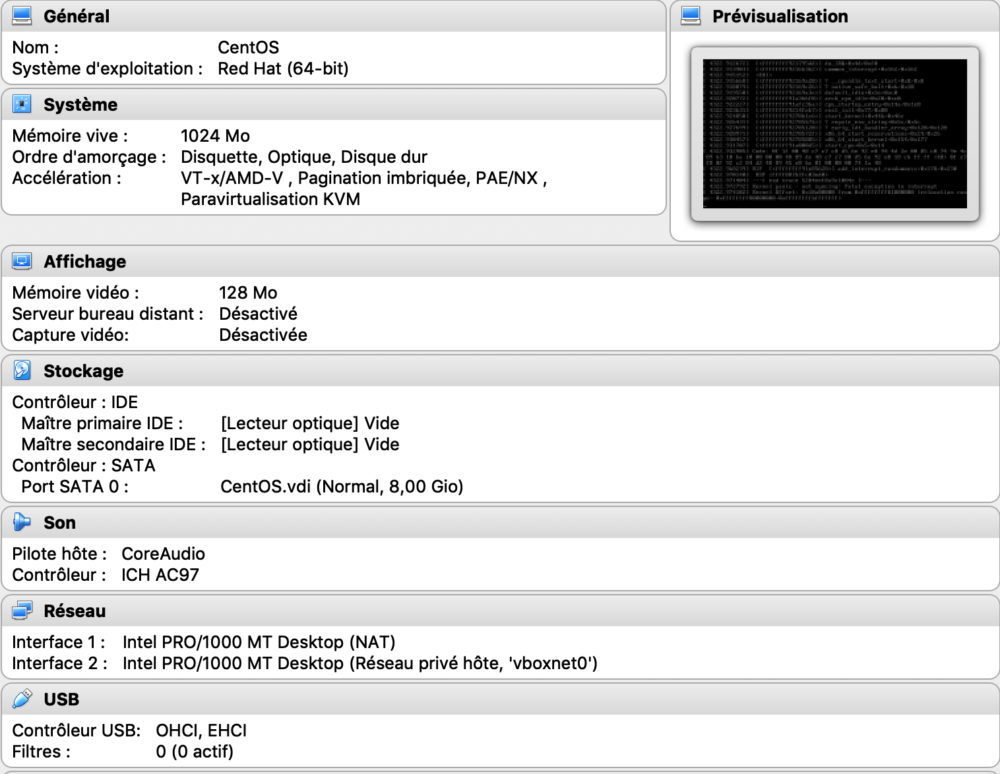
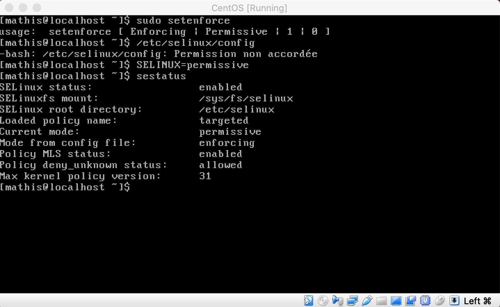
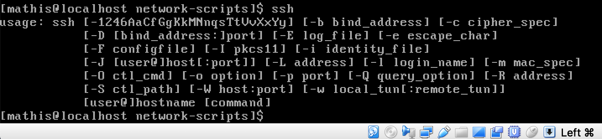
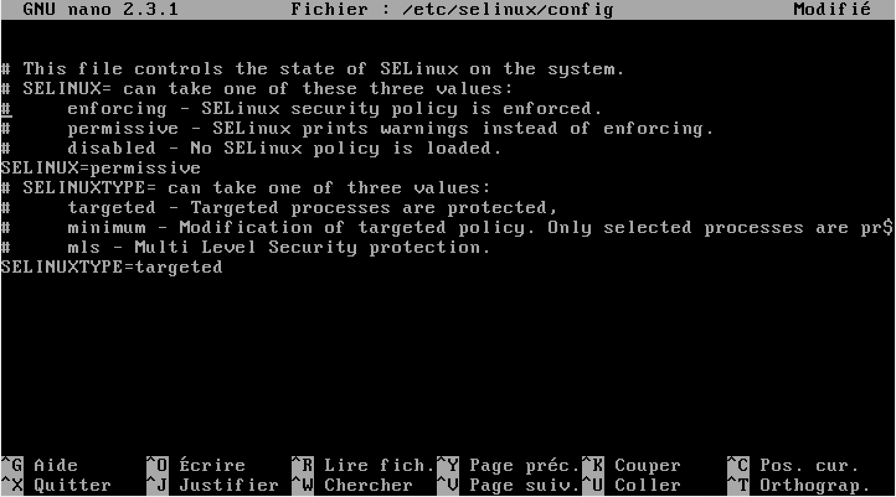
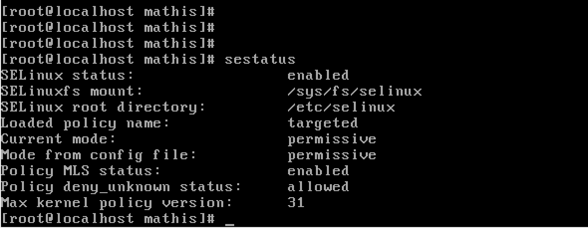

<meta charset="UTF-8">

**Mathis BIANCO**

**Sacha Sallès**

#B1-Réseau-2018 TP3
-----------------

##Partie 1-4 Vue en cours
-----------------

### I.Création et utilisation simples d'une VM CentOS
*********************************************************
# 1.Création
  Création de ma VM effectue sur VirtualBox vue en cours.
-----------------



-----------------
# 2. Installation de l'OS



# 3. Premier Boot



# 4.Configuration réseau d'une machine CentOS


# 5.Faire joujou avec quelques commandes


<p>Pour le "curl"
Sur mon terminal j'ai indique "www.google.com"
Sur mon terminal j'ai indique "www.ynov.com

<p>Pour "dig"
j'ai du installer "sudo yum install bind-utils"
Ensuite dig www.google.com ou
dig www.ynov.com

L'IP est indique à la fin du terminal donc "192.31.80.30" (google)
L'IP est indique à la fin du terminal donc "192.55.83.30" (ynov)


# II. Notion de ports et SSH
**1. Exploration des ports locaux
-----------------
*Commande utilisez "SS" <br>
*commande utilisez pour vérifiez si ssh est bien installer. <br>
*effectuez sur un terminal de ma VM<br>
*"yum list installed openssh-server"
<br>
<br>
*other façon de vérifier SSH
*"ls -al /etc/ssh/sshd_config"
<br>
*voir l'état du du service SSH <br>
*"systemctl status sshd"

On indique cette commande pour seulement voir le port 22, il est bien "listen"
"ss -lntp |grep "22""


### 2. SSH




### 3. Firewall
-----------------
**A.SSH**

`modifier le fichier`





### III. Routage statique
-----------------
**Pour rappel, il faut désactiver SELinux.**
```
+ Le routage, c'est le fait d'utiliser une machine comme pivot (le routeur), entre deux réseau, afin qu'il fasse passer le trafic d'un réseau à un autre.
+ Le routage statique consiste à définir de façon simple les routes utilisables par le routeur et les machines.  
+ C'est  l'administrateur qui les définit à la main.
```
+ sudo setenforce 0
+ modifier le fichier /etc/selinux/config
+ modifier la valeur de SELINUX à permissive
+ SELINUX=permissive
+ pour vérifier : sestatus doit afficher Current mode: permissive


-----------------
**0. Rappels et objectifs**
```
+ deux PCs reliés avec un câble
+ les interfaces Ethernet des deux PCs étaient dans le même réseau pour pouvoir communiquer
+ "être dans le même réseau" c'est avoir une adresse IP dans le même réseau IP
```


-----------------




